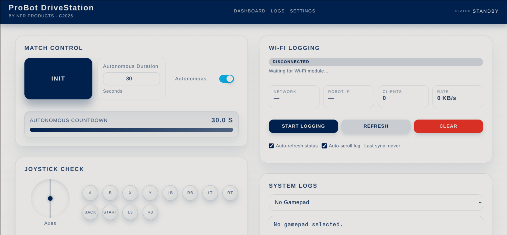

# İlk Bakış

Bu sayfa Probot'un nasıl çalıştığını gösterir. Sonunda: bir kod ESP32'ye yüklü, telefon robota bağlı, Driver Station açık, joystick sol çubuğu ekranda değer değiştiriyor.

---

## Nasıl Çalışır

Normal bir Arduino projesinde kod doğrudan çalışır: kart açılır, program başlar. Probot'ta araya bir katman giriyor.

ESP32 açılınca bir **WiFi erişim noktası** oluşturur. Adı ve şifresi kodda tanımlanır. Telefon veya tablet bu ağa bağlanır; tarayıcıda `192.168.4.1` adresi açılınca **Driver Station** arayüzü yüklenir. Arayüzden Init ve Start yapılır; robot ancak o zaman çalışmaya başlar.

Joystick verisi de aynı yoldan gider. Kumanda, arayüzü açan cihaza bağlı olmalı. Tarayıcı joystick değerlerini alır ve ESP32'ye iletir. Bu yüzden kumandayı bilgisayara değil, telefon veya tablete bağlamak gerekir.

Kod tarafında normal Arduino'nun `setup()` ve `loop()` fonksiyonları yok; kütüphane bunlara sahip, kullanıcı tanımlarsa derleme hatası alınır. Bunların yerine maçın fazlarına karşılık gelen altı hook tanımlanır. Hepsi zorunludur, boş olabilirler.

---

## Minimal Kod

Arduino IDE'ye yapıştırılıp doğrudan yüklenebilir. Üç makro değiştirilmeli:

```cpp
#define PROBOT_WIFI_AP_SSID     "RobotAdi"      // WiFi ağ adı
#define PROBOT_WIFI_AP_PASSWORD "sifre1234"     // en az 8 karakter
#define PROBOT_WIFI_AP_CHANNEL  1               // 1, 6 veya 11 önerilir
#include <probot.h>

void robotInit()     {}
void robotEnd()      {}
void teleopInit()    {}
void teleopLoop()    { delay(20); }
void autonomousInit(){}
void autonomousLoop(){ delay(20); }
```

**Makrolar neden `#include`'dan önce?** Kütüphane bu değerleri derleme sırasında okur; `#include`'dan sonra tanımlanırsa kütüphane göremez. Sıra zorunlu.

**`delay(20)` neden var?** Loop ~50 Hz'de çağrılır; içi tamamen boş olsa da çalışır. `delay(20)` CPU'yu gereksiz yere meşgul etmemek için yeterli. Motorlar bağlandığında bu satırın yerine gerçek kod yazılır.

Kodu derle ve yükle. Serial Monitör (115200 baud) açılınca şuna benzer bir çıktı gelir:

```
[DS   ] WiFi SSID: RobotAdi
[DS   ] IP Address: 192.168.4.1
[DS   ] HTTP server started on port 80
```

---

## WiFi Bağlantısı

1. Telefon veya tabletin WiFi ayarlarından `RobotAdi` ağına bağlan.
2. Tarayıcı bir **captive portal** açabilir; açılırsa Driver Station oraya yüklenir. Açılmazsa adres çubuğuna `http://192.168.4.1` yaz. `https` değil, `http`; tarayıcı otomatik `https`'e çevirmeye çalışırsa adres çubuğuna tekrar `http://` ile başlayarak yaz.
3. Sayfanın yüklenmesi birkaç saniye sürebilir; ESP32 aynı anda hem HTTP hem WebSocket sunuyor.

---

## Driver Station Arayüzü



Sol panel kontrol paneli: Init / Start / Stop butonları, otonom ayarları, joystick görüntüsü. Sağ panel: WiFi ve sistem logları, telemetri çıktısı.

Arayüzdeki akış her maçta aynı sırayı izler:

| Buton | Ne yapar | LED |
|---|---|---|
| **Init** | `robotInit()` bir kez çalışır. Robot hazır, hareketsiz. | Sarı sabit |
| **Start** | `teleopInit()` bir kez, ardından `teleopLoop()` ~50 Hz. Otonom açıksa önce otonom çalışır. | Yeşil / turuncu yanıp söner |
| **Stop** | `robotEnd()` bir kez çalışır. Her şey sıfırlanır. | Mavi yanıp söner |

Robota bağlanıldığında LED mavi yanıp sönüyorsa Driver Station bağlı, Init bekleniyor demektir. LED mavi sabit yanıyorsa hiçbir cihaz bağlı değildir.

---

## Joystick Bağlama

Kumanda, arayüzü açan cihaza bağlı olmalı; bilgisayara değil. Bunun nedeni: joystick verisi tarayıcıdaki Gamepad API üzerinden alınır ve WebSocket ile robota iletilir. Kumanda bilgisayara bağlıysa tarayıcı onu göremez.

Kumanda bağlandıktan sonra Driver Station joystick durumunda hâlâ **"Not Connected"** yazıyorsa kumandada herhangi bir butona bas; arayüz **"Press any controller button to activate."** uyarısını gösterir. Tarayıcı Gamepad API'si güvenlik kısıtı nedeniyle kullanıcı bir butona basmadan joystick'i yazılıma açmaz.

Buton basıldıktan sonra arayüzde joystick görselinin güncellenmesi gerekir. Güncellenmiyorsa kumanda profili uyumsuz olabilir; [Yazılım - Kumanda Profili](yazilim.md#kumanda-profili) sayfasına bakılabilir.

---

## İlk Joystick Verisi

`teleopLoop()`'u aşağıdaki kodla değiştir. Sol çubuğun dikey değeri her loop turunda Driver Station ekranına yazılır:

```cpp
void teleopLoop() {
    auto js = probot::io::joystick_api::makeDefault();
    probot::clearTelemetry();
    probot::printf("Sol Y: %.2f\n", js.getLeftY());
    delay(20);
}
```

Init → Start yap, sol çubuğu hareket ettir. Sağ panelde değer değişiyor olmalı: çubuk ileri pozitif, geri negatif.

`clearTelemetry()` ekranı her turda temizler; yoksa önceki değerler birikir. `printf` format dizgisi `"%.2f"` ondalık sayıyı iki basamakla yazar.

---

Buradan sonra: [Yazılım](yazilim.md) sayfasında tüm hook'lar, joystick API'si, motor ve servo kontrolü.
