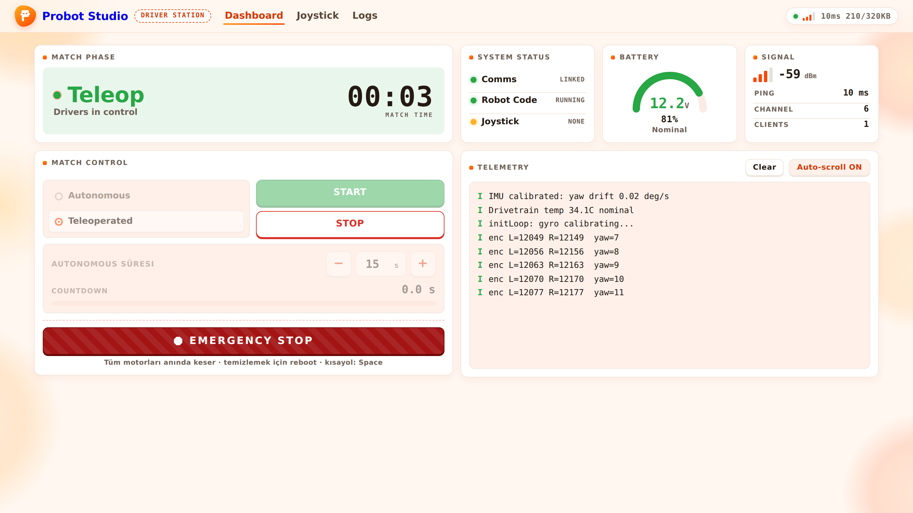

# İlk Bakış

Bu sayfa Probot'un nasıl çalıştığını gösterir. Sonunda: bir kod ESP32'ye yüklü, telefon robota bağlı, Driver Station açık, joystick sol çubuğu ekranda değer değiştiriyor.

---

## Nasıl Çalışır

Normal bir Arduino projesinde kod doğrudan çalışır: kart açılır, program başlar. Probot'ta araya bir katman giriyor.

ESP32 açılınca bir **WiFi erişim noktası** oluşturur. Adı ve şifresi kodda tanımlanır. Telefon veya tablet bu ağa bağlanır; tarayıcıda `192.168.4.1` adresi açılınca **Driver Station** arayüzü yüklenir. Arayüzden mod seçilir (Otonom veya TeleOp), Init ve Start yapılır; robot ancak o zaman çalışmaya başlar.

Joystick verisi de aynı yoldan gider. Kumanda, arayüzü açan cihaza bağlı olmalı. Tarayıcı joystick değerlerini alır ve ESP32'ye iletir. Bu yüzden kumandayı bilgisayara değil, telefon veya tablete bağlamak gerekir.

Kod tarafında normal Arduino'nun `setup()` ve `loop()` fonksiyonları yok; kütüphane bunlara sahip, kullanıcı tanımlarsa derleme hatası alınır. Bunların yerine maçın fazlarına karşılık gelen hook'lar tanımlanır; dördü zorunludur (`autonomousLoop`, `autonomousStop`, `teleopLoop`, `teleopStop`), kalanlar opsiyoneldir. Gövdeleri boş olabilir.

---

## Minimal Kod

Arduino IDE'ye yapıştırılıp doğrudan yüklenebilir. Üç makro değiştirilmeli:

```cpp
#define PROBOT_WIFI_AP_SSID     "RobotAdi"      // WiFi ağ adı
#define PROBOT_WIFI_AP_PASSWORD "sifre1234"     // en az 8 karakter
#define PROBOT_WIFI_AP_CHANNEL  1               // 1, 6 veya 11 önerilir
#include <probot.h>

void autonomousInit() {}
void autonomousLoop() { delay(20); }
void autonomousStop() {}
void teleopInit()     {}
void teleopLoop()     { delay(20); }
void teleopStop()     {}
```

**Makrolar neden `#include`'dan önce?** Kütüphane bu değerleri derleme sırasında okur; `#include`'dan sonra tanımlanırsa kütüphane göremez. Sıra zorunlu.

**`delay(20)` neden var?** Loop ~50 Hz'de çağrılır; içi tamamen boş olsa da çalışır. `delay(20)` CPU'yu gereksiz yere meşgul etmemek için yeterli. Motorlar bağlandığında bu satırın yerine gerçek kod yazılır.

Kodu derle ve yükle. Serial Monitör (115200 baud) açılınca şuna benzer bir çıktı gelir:

```
[DS   ] WiFi SSID: RobotAdi
[DS   ] IP Address: 192.168.4.1
[DS   ] HTTP server started on port 80
```

---

## WiFi Bağlantısı

1. Telefon veya tabletin WiFi ayarlarından `RobotAdi` ağına bağlan.
2. Tarayıcı bir **captive portal** açabilir; açılırsa Driver Station oraya yüklenir. Açılmazsa adres çubuğuna `http://192.168.4.1` yaz. `https` değil, `http`; tarayıcı otomatik `https`'e çevirmeye çalışırsa adres çubuğuna tekrar `http://` ile başlayarak yaz.
3. Sayfanın yüklenmesi birkaç saniye sürebilir; ESP32 aynı anda hem HTTP hem WebSocket sunuyor.

---

## Driver Station Arayüzü



Arayüz üç sekmeden oluşur. **Dashboard** maçın yönetildiği yer: Match Control (mod seçici Otonom / TeleOp, Init / Start / Stop butonları, otonom süresi), kırmızı **Emergency Stop**, maç fazı ve sayacı, batarya/sinyal göstergeleri ve telemetri konsolu. **Joystick** sekmesinden girdi kaynağı yönetilir, **Logs** sekmesinde WiFi ayarları, sistem bilgisi ve geçmiş grafikleri var.

Klavyedeki **Space tuşu her zaman Emergency Stop'tur** — arayüz açıkken hangi sekmede olursan ol çalışır (yalnız bir yazı alanına yazarken devreye girmez).

Arayüzdeki akış her maçta aynı sırayı izler:

| Buton | Ne yapar | LED |
|---|---|---|
| **Mod seçici** | Otonom veya TeleOp seçilir. Yalnız robot dururken değiştirilebilir; Init veya Start sonrası reddedilir, önce Stop gerekir. | Mavi yanıp söner |
| **Init** | Seçili modun init hook'u (`autonomousInit()` veya `teleopInit()`) bir kez çalışır. Robot hazır, hareketsiz. | Sarı sabit |
| **Start** | Seçili modun loop hook'u (`autonomousLoop()` veya `teleopLoop()`) ~50 Hz çalışmaya başlar. | Otonomda turuncu, TeleOp'ta yeşil yanıp söner |
| **Stop** | Seçili modun stop hook'u (`autonomousStop()` veya `teleopStop()`) bir kez çalışır. Robot durur. Kooperatiftir: o anki loop turu bittikten sonra devreye girer. | Mavi yanıp söner |
| **Emergency Stop** | Acil durdurma: kullanıcı task'ı anında öldürülür, aktif modun stop hook'u watchdog'lu çalıştırılır, robot **reboot'a kadar kilitlenir** (Init/Start reddedilir). Donmuş bir loop'u bile durdurur. | — |

Robota bağlanıldığında LED mavi yanıp sönüyorsa Driver Station bağlı, mod seçimi ve Init bekleniyor demektir. LED mavi sabit yanıyorsa hiçbir cihaz bağlı değildir.

---

## Joystick Bağlama

Kumanda, arayüzü açan cihaza bağlı olmalı; bilgisayara değil. Bunun nedeni: joystick verisi tarayıcıdaki Gamepad API üzerinden alınır ve WebSocket ile robota iletilir. Kumanda bilgisayara bağlıysa tarayıcı onu göremez.

Kumanda bağlandıktan sonra Joystick sekmesindeki Gamepad kartında yazdığı gibi **herhangi bir tuşa bas** — kumanda otomatik tanınır ve seçilir. Tarayıcı Gamepad API'si güvenlik kısıtı nedeniyle kullanıcı bir butona basmadan joystick'i yazılıma açmaz.

Buton basıldıktan sonra arayüzde joystick göstergelerinin güncellenmesi gerekir. Güncellenmiyorsa kumanda profili uyumsuz olabilir; [Yazılım - Kumanda Profili](yazilim.md#kumanda-profili) sayfasına bakılabilir.

**Kumanda yoksa** Joystick sekmesindeki alternatif kaynaklar elle etkinleştirilebilir; ikisi de otomatik seçilmez, karttaki **Etkinleştir** ile açılır:

- **Klavye** (yalnız masaüstünde görünür): WASD sol çubuk, ok tuşları sağ çubuk, 1-4 = A/B/X/Y, Q/E = LB/RB. Space burada da E-stop'tur.
- **Dokunmatik** (yalnız telefon/tablette görünür): tam ekran sürüş görünümü açılır — sanal çubuklar ve butonlar.

---

## İlk Joystick Verisi

`teleopLoop()`'u aşağıdaki kodla değiştir. Sol çubuğun dikey değeri her loop turunda Driver Station ekranına yazılır:

```cpp
void teleopLoop() {
    auto js = probot::io::joystick_api::makeDefault();
    probot::clearTelemetry();
    probot::printf("Sol Y: %.2f\n", js.getLeftY());
    delay(20);
}
```

TeleOp modunu seç, Init → Start yap, sol çubuğu hareket ettir. Dashboard'daki telemetri konsolunda değer değişiyor olmalı: çubuk ileri pozitif, geri negatif.

`clearTelemetry()` ekranı her turda temizler; yoksa önceki değerler birikir. `printf` format dizgisi `"%.2f"` ondalık sayıyı iki basamakla yazar.

---

Buradan sonra: [Yazılım](yazilim.md) sayfasında tüm hook'lar, joystick API'si, motor ve servo kontrolü.
